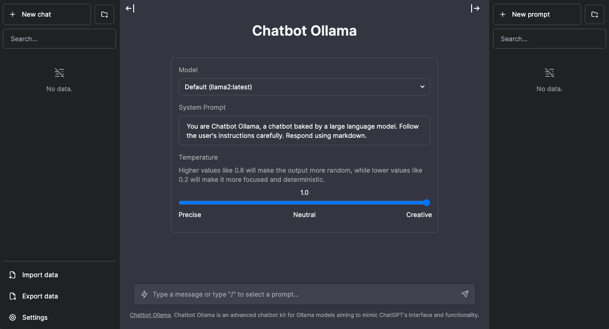

# Chatbot Ollama

## About

Chatbot Ollama is an open source chat UI for Ollama.

This project is based on [chatbot-ui](https://github.com/mckaywrigley/chatbot-ui) by [Mckay Wrigley](https://github.com/mckaywrigley).



## Updates

Chatbot Ollama will be updated over time.

### Next up

- [ ] pull a model
- [ ] delete a model
- [ ] show model information

## Architecture

This project has two main components:
1. A Next.js frontend for the user interface
2. A FastAPI backend for handling API requests and database operations

## Docker

Build locally:

```shell
docker build -t chatbot-ollama .
docker run -p 3000:3000 chatbot-ollama
```

Pull from ghcr:

```bash
docker run -p 3000:3000 ghcr.io/ivanfioravanti/chatbot-ollama:main
```

### Docker Compose (Recommended)

The recommended way to run the application is using Docker Compose, which will set up all required services:

```bash
docker-compose up
```

This will start:
- The Next.js frontend
- The FastAPI backend
- PostgreSQL database
- Ollama server

## Running Locally

### 1. Clone Repo

```bash
git clone https://github.com/ivanfioravanti/chatbot-ollama.git
```

### 2. Move to folder

```bash
cd chatbot-ollama
```

### 3. Install Dependencies

```bash
npm ci
```

### 4. Run Ollama server

Either via the cli:

```bash
ollama serve
```

or via the [desktop client](https://ollama.ai/download)

### 5. Set up and run the FastAPI backend

```bash
cd backend
python -m venv env
source env/bin/activate  # On Windows, use: env\Scripts\activate
pip install -r requirements.txt
python -m app.db.create_db  # Initialize the database
uvicorn app.main:app --host 0.0.0.0 --port 8000 --reload
```

### 6. Run the Next.js Frontend

```bash
cd ..  # Return to the project root
npm run dev
```

### 7. Use It

You should be able to start chatting.

## Configuration

When deploying the application, the following environment variables can be set:

### Frontend Environment Variables

| Environment Variable              | Default value                  | Description                                                                                                                               |
| --------------------------------- | ------------------------------ | ----------------------------------------------------------------------------------------------------------------------------------------- |
| DEFAULT_MODEL                     | `mistral:latest`                | The default model to use on new conversations                                                                                             |
| NEXT_PUBLIC_DEFAULT_SYSTEM_PROMPT | [see here](utils/app/const.ts) | The default system prompt to use on new conversations                                                                                     |
| NEXT_PUBLIC_DEFAULT_TEMPERATURE   | 1                              | The default temperature to use on new conversations                                                                                       |
| FASTAPI_BACKEND_URL               | `http://localhost:8000`        | URL of the FastAPI backend                                                                                                               |

### Backend Environment Variables

| Environment Variable | Default value                  | Description                   |
| -------------------- | ------------------------------ | ----------------------------- |
| PG_USER              | `postgres`                     | PostgreSQL username           |
| PG_HOST              | `localhost`                    | PostgreSQL host               |
| PG_DATABASE          | `chatbot_ollama`               | PostgreSQL database name      |
| PG_PASSWORD          | `lap20040106`                  | PostgreSQL password           |
| PG_PORT              | `5432`                         | PostgreSQL port               |
| OLLAMA_HOST          | `http://127.0.0.1:11434`       | Ollama API URL                |
| LMSTUDIO_HOST        | `http://127.0.0.1:1234`        | LMStudio API URL (optional)   |

## PostgreSQL Database Setup

This application uses PostgreSQL for data storage. Follow these steps to set up the database connection:

### 1. Install PostgreSQL

Make sure you have PostgreSQL installed and running on your system or server.

### 2. Configure Environment Variables

Create a `.env.local` file in the root directory and a `.env` file in the backend directory with the appropriate environment variables as listed in the Configuration section.

### 3. Database Initialization

The FastAPI backend will automatically create the necessary tables when you initialize it with:

```bash
python -m app.db.create_db
```

### 4. Testing Database Connection

You can test the database connection by visiting `/api/db-test` endpoint after starting the application.

## API Documentation

Once the FastAPI backend is running, you can access the API documentation at:
- http://localhost:8000/docs (Swagger UI)
- http://localhost:8000/redoc (ReDoc)

## Contact

If you have any questions, feel free to reach out to me on [X](https://x.com/ivanfioravanti).
